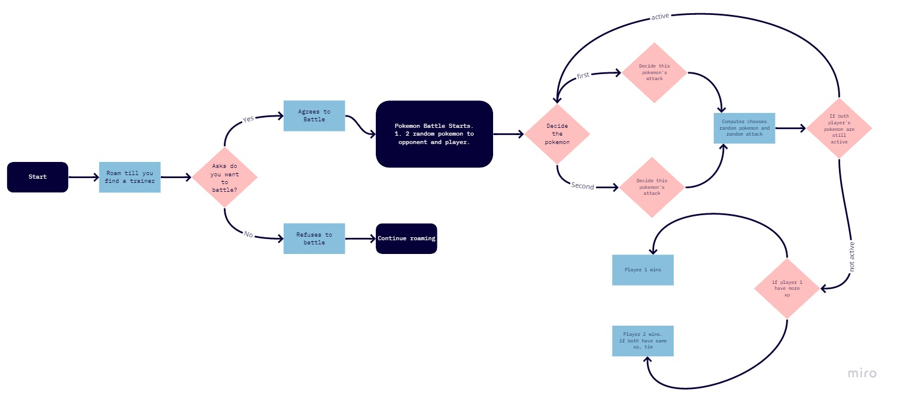
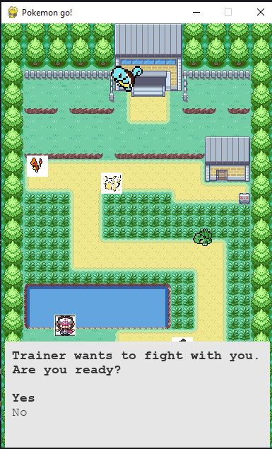
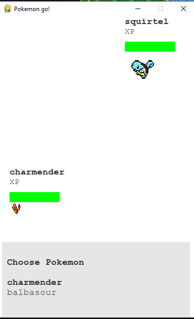
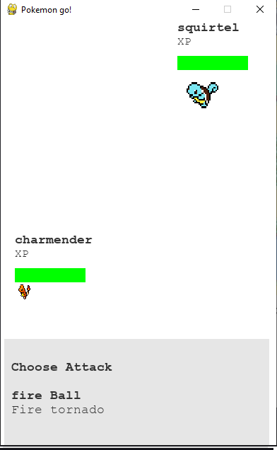
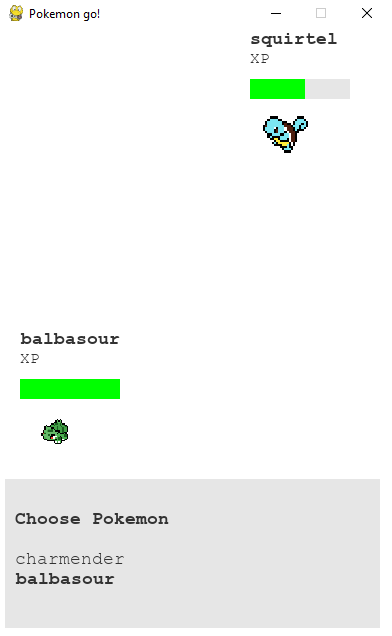
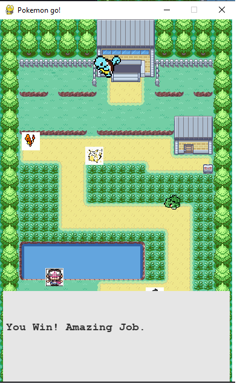

# Pokemon Go with Tkinter
### In this game you can roam around in a garden arena. When you come in contact with a player, you can have a Pokemon battle. 
### In a Pokemon battle user and computer are allotted 2 random Pokémon. They can then switch them between battle, choose their attacks. At the end, if a player's Pokemon have no more XP left, the match is over.

## Here are some in game shots

#### The game has some bugs, specially the coordinate system makes no sense. 
